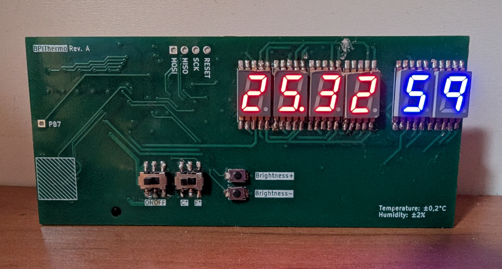
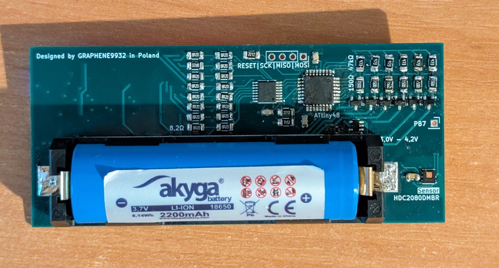
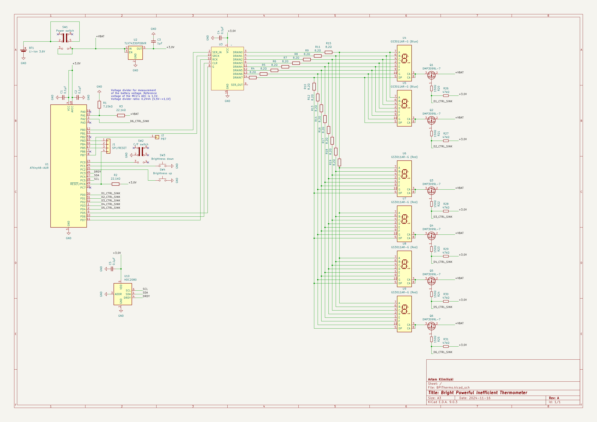

# BPIThermo
Bright Powerful Inefficient Thermometer



## Description
My first electronics project with custom PCB! Soldered manually with lead-free solder.

This is an 18650 Li-Ion battery powered device which samples relative humidity (±1% RH) and temperature (±0,2 °C) 5 times a second displaying the measurement results on a six-digit
seven-segment LED display.

### Features
- Celsius and Fahrenheit modes.
- Precise brightness control with brightness being saved to EEPROM.
- Warnings about low battery level, as well as auto shutdown under critically low voltage.

## Electronic schematic


## Build from source
### Prerequisites
- `avr-binutils`
- `avrdude`
- `make`

### Build
```
$ git clone https://github.com/GRAPHENE9932/BPIThermo
$ cd BPIThermo
$ make
```

### Upload via ArduinoISP programmer
```
# make upload
```
